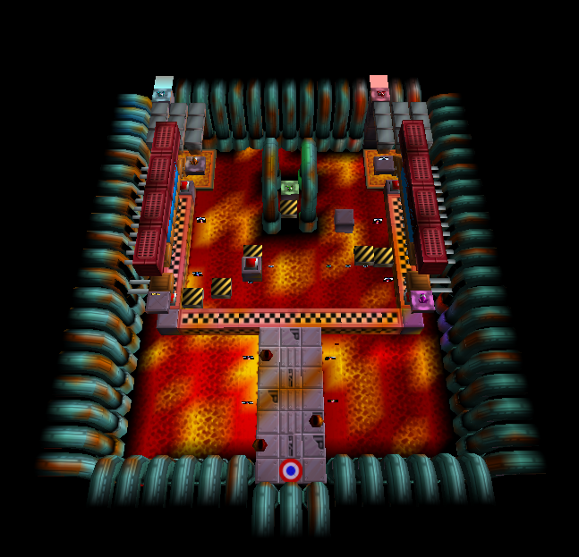

# Public TriangleMesh Vertex Color API (Draft)
## Summary
Add vertex colors to the fixed-capability TriangleMesh definition with shading behavior consistent with how vertex colors operate across other 3D applications.

**Visual Reference:**  

| Without Vertex Colors                                                              | With Vertex Colors                                                           |
|------------------------------------------------------------------------------------|------------------------------------------------------------------------------|
|  |  |
|   |   |


## Goals
The goals of this proposal are:
- Expand existing fixed-capability TriangleMesh definition to support gouraud modulated vertex coloring.
- Integrate with lighting without changing how existing non-colored 3D meshes are lit.

## Non-Goals
- Supporting arbitrary (user-supplied) shaders.
- Supporting arbitrary (user-configurable) vertex buffer data. (Would require supporting user-supplied shaders.)

## Success Metrics
Feature works as described with no meaningful performance loss.

## Motivation

Vertex coloring is a core 3D rendering feature supported by virtually every other 3D rendering system.
This is true whether the 3D rendering library is high-level (Java3D, jmonkeyengine, OpenInventor, etc), low-level (DirectX, Metal, Vulkan, OpenGL), or somewhere in-between (Unreal Engine, Unity, Blender, etc).
The only major project I could even find which does not support vertex colors is JavaFX.
The reason this feature is so ubiquitous is that it allows adding a lot of detail to a 3D scene with a near-zero performance cost, with usage dating back to the pre-hardware acceleration days.

My personal motivation for this feature is that I make an application which allows modifying data in a dozen or so old video games. 
It allows people to view unused game content, but also create new game content (modding) which can be played with the original game executables.
Every single game I've supported so far uses vertex colors. There's quite a bit of variety in those games too, there are various different engines, and different game consoles too.
Yet because JavaFX doesn't support this basic feature I've had to resort to workarounds.
In other words, I've created a system which generates a unique shaded texture for every single unique polygon in a 3D mesh, aggregated into a mega-texture.
This is extremely slow, and this system just can't be used with some of the more demanding games.
JavaFX's interoperability/compatibility from most other 3D software is significantly diminished until it supports vertex colors.
I'd go as far as to say I don't think I would be using JavaFX if I had understood this limitation when I had started my project.
How many projects chose not to use JavaFX because it was missing this feature? I don't know.
But I can point out various JavaFX projects which either explicitly said they'd like vertex color support, or if I couldn't get in contact with them, I believe there's a strong case that they would benefit from vertex color support.

### Here are some JavaFX Projects which will benefit from the feature
- [FXyz](https://github.com/FXyz/FXyz) (The most popular/promoted JavaFX 3D project): 
  - Birdasaur (The main FXyz author) explicitly expressed interest in vertex color support [here](https://github.com/Teragam/JFXShader/issues/9#issuecomment-2002035034).
  - He also detailed how FXyz had to implement the same kind of texture generation system I made for my tool because there was no vertex color support in JavaFX.
  - This is the biggest JavaFX 3D project I'm aware of, so I think this should be a very strong case that the community as a whole will benefit from these changes, not just my tool.
- [FrogLord](https://github.com/Kneesnap/FrogLord) (This is my project for editing old video game data / creating mods and new playable game content):
  - As described before, I have several games currently which my fake vertex coloring (via creating a shader with a separate texture for every polygon) is just too inefficient for, leaving me with no way to accurately render maps for those games.
  - I've profiled this system extensively, made it run in parallel, etc. But ultimately a texture generator is just not the right solution.
  - I will probably either need to fork JavaFX or leave it for something else if I do not get this feature.
- [GameExtractor](https://github.com/wattostudios/GameExtractor) (Similar to FrogLord, it's used to view game assets from various different game files.):
  - Looking through the source code, there are several very popular file formats that use vertex colors supported by this tool. However, this tool just ignores the vertex colors because it has no way of displaying them.
  - Adding support for vertex colors would let this program actually display 3D models accurately.
- [FXGL](https://github.com/AlmasB/FXGL) (Game Engine):
  - Anyone who wants to make a 3D game with this will have a new tool for making their meshes look better.
  - Was unable to get in touch with the author, but I think my explanation of why this project benefits is clear.
- [JFXShader](https://github.com/Teragam/JFXShader) (Adds shaders to JavaFX):
  - This project enables user-supplied shaders.
  - JFXShader doesn't benefit from vertex colors per-say, but more-so the fact that it exists proves that there is demand for expansion of visual capabilities such as vertex colors.
  - In theory JFXShader can be used to implement vertex colors, but it's more of a prototype than something I want to use in a stable application.
  - It also implements it in a much worse way than if we were to implement them directly in JavaFX.

## Description
The vertex color API supports two major functions:
 - Specifying if a TriangleMesh contains vertex color data or not.
 - Specifying color component data on an indexed per-face-vertex basis.

TriangleMesh.java as it exists has already established design patterns for both of these functions.
As such, the public API specification merely applies the previously established design patterns to the new feature.

### Public API Specification
Usage of the following API methods is consistent with the existing TriangleMesh API behavior.
Discussion of the API design choices is included below.

**TriangleMesh.java:**  
```java
+ public int getColorElementSize(); // Same as the other getXYZElementSize() methods, but for vertex color element size.
// Same as the pre-existing getXYZ() vertex buffer methods but for vertex color data.
// Four floating point values are required to represents a single color. (One for each of red, green, blue, alpha).
// Providing a value of 1.0 will cause there to be no impact on the output pixel color.
// Providing a value of 2.0 will double the intensity of the pixel color component value. (Eg: red)
+ public ObservableFloatArray getColors();
```

**VertexFormat.java:**  
```java
+ public static final VertexFormat POINT_TEXCOORD_COLOR; // Same as the previous POINT_TEXCOORD definition, but with color support.
+ public static final VertexFormat POINT_NORMAL_TEXCOORD_COLOR; // Same as the previous POINT_NORMAL_TEXCOORD definition, but with color support.
+ public int getColorIndexOffset(); // Same purpose as the other getXYZIndexOffset() methods but for color indices.
```

### How are the vertex colors actually used when rendering?
The term used to describe how the vertex colors is applied is "gouraud modulated vertex shading".  
In this phrase, the word "gouraud" describes the vertex colors as applied on a per-vertex (not per-pixel) basis, and interpolated between each other when drawn as a polygon.  
That interpolation occurs automatically by the GPU (for each pixel) drawn between the vertices which make up the polygon.  
Next, the term "modulated" refers to how the vertex color values are multiplied against another color (in this case, the pre-lit diffuse pixel color or the self-illumination pixel color).  

In other words, the impact on the 3D visuals is described by the following pseudocode:  
**Diffuse:**  
```glsl
// Before the change
diffusePixelColor = pixelFromDiffuseTexture * globalDiffuseColor;

// After the change
diffusePixelColor = pixelFromDiffuseTexture * globalDiffuseColor * vertexColor;
```

**Self-Illumination:**  
```glsl
// Before the change.
selfIllumPixelColor = pixelFromSelfIllumTexture;

// After supporting vertex colors.
selfIllumPixelColor = pixelFromSelfIllumTexture * vertexColor;
```

## API Design Choices & Discussion Points
Here's a list of design justifications and/or discussion points which have been discussed for this change.

### Is this really the best public API design?
In an email thread, one concern shared was in which class the vertex color support belonged.
Did it belong directly in TriangleMesh.java? Should we make a new class which extends TriangleMesh.java? Do we create a new mesh system entirely?
I'd like to break down the pros and cons of each option, and explain why I believe adding the additional functionality to TriangleMesh.java is the best option.

#### Creating a new class ColoredTriangleMesh extending TriangleMesh:
Pros:  
- It would allow isolation of vertex coloring so that the buffer is not even defined in the class if the mesh cannot use vertex colors.
- Does not conflict with a future user-supplied shader system.

Cons:  
- We would be forced to either break the existing design of VertexFormat.java OR TriangleMesh.java would have to deal with not being able to support certain VertexFormats without being extended, conflicting with the existing design of setVertexFormat() allowing TriangleMesh to assume any VertexFormat.
  - Eg: Certain VertexFormat objects would exist that TriangleMesh.java would be incompatible with on its own.
- Breaks the existing design patterns already established by TriangleMesh.java where optional buffers (ie: normals) are defined in TriangleMesh.java, and are used/not used based on the VertexFormat.

Non Factors:
- It was brought up that "add(ing) more bespoke formats" explicitly in JavaFX doesn't seem like a good solution, suggesting that letting the user define their own vertices/vertex buffers was a better option.
  - However, letting the user define their own vertex formats/vertex is impossible without user-supplied shader support, as shader modifications are the only way to use any such data.
  - Additionally, Kevin said he was doubtful that JavaFX will ever support user-supplied shaders because of the complexity of supporting such a feature.
  - My response is that JavaFX should explicitly support vertex colors regardless of if user-supplied shaders are ever supported due to the added complexity for the developer if they were to use shaders themselves.
  - This does raise the question of if my proposed vertex color implementation clashes with a future implementation of user-supplied shaders.
  - While it is possible to imagine issues, these issues are nothing that wouldn't have already existed from the way that normals are already implemented in TriangleMesh. Also, there are ways to work around this issue anyways.

#### Creating a new type of mesh which allows the user to specify how they would like a vertex to be formatted?
This solution is not possible without user-supplied shaders as without the user supplying a shader, their supplied data would not be used by the GPU.  
Even if user-supplied shaders were supported, it wouldn't help either as only a pipeline without user-shader support would benefit from having explicit vertex color support.  
And since that pipeline will exist regardless of if user-supplied shaders are added or not, this design idea isn't relevant.  

#### Expand the functionality of the existing TriangleMesh.java?
This is the option which I strongly believe is the right choice.

Pros:
 - Consistent with existing design patterns of TriangleMesh.java/VertexFormat.java
 - Does not create scenarios where there are VertexFormat objects which are valid, but the base class of TriangleMesh cannot use them.
 - Does not conflict with a future user-supplied shader system.
 - Avoids unnecessary/unhelpful inheritance.

Cons:
 - When using a non-colored VertexFormat, the methods for working with vertex colors are still present on the TriangleMesh class despite not doing anything. (Minor, and this was already the case with normals.)

### Why use a ObservableFloatArray with four float values instead of ObservableIntegerArray with one ARGB8888 value?
**Benefits of Integers:**  
 - Takes up much less memory than floats.

**Drawbacks of Integers:**
 - Modern GPU workflow is designed for almost all values (including colors) to be floating point numbers. If we provide the GPU with integers, all we've done is just shifted the responsibility to the GPU to convert them from an integer to floats.
 - Can represent a much smaller range of color modulation options than float, as we'd likely need to treat each color component byte as a value between 0.0 and 2.0, where-as a float can represent values larger than 2.0.
 - A rewrite of most of the internal 3D rendering code would be required to (properly) support non-float values in the render buffer due to the lack of the ability to define value-type (as opposed to reference-type) data structures in Java. 
   - In theory, if we could write a performant function which can get a 32-bit integer as a float data type (which is represented by the same bits as the 32-bit integer), this would be a hacky way of avoiding a rewrite.
   - However, it would also require parsing on the GPU to convert the integer into floats, since the GPU workflow is best suited to treating colors as floats.

**Benefits of Floats:**
- Modern GPU workflow is designed for almost all values (including colors) to be floating point numbers.
- Does not require a full rewrite of all internal 3D rendering code.
- Allows a larger modulation range, as we would not be clamped at a maximum value of 2.0 per color component.

**Drawbacks of Floats:**
- Takes up more memory than if integers were used as there's now a float for each color component instead of one integer for the entire color.

### Metal Support?
So, I'm responsible for Metal support too. That's fine, it should be straightforward to support.
However, as I've asked and not received a response, I'm going to propose how I'm going to treat Metal. Please let me know if there are any issues with this.  
Either vertex colors or Metal support can be merged / rebased first, ideally whichever is finished / ready first would be released first.  
Then, I'll merge in the changes to the other, and add Metal support.  
I've gotten a Mac Mini to do this as I never heard back on if I'd have help with testing.  
I'm hoping Kevin can comment on this & give a clear answer.  

## Alternatives

### JFXShader
JFXShader (mentioned earlier) allows writing custom shaders for use with JavaFX.
While it is possible to implement vertex colors with it, there are many reasons this is not an adequate/appropriate option.
JFXShader is closer to a prototype than something that belongs in a stable application.
Also, it would require every user who wants vertex colors to be proficient in GLSL + HLSL + OpenGL + DirectX + Metal (once that releases) + Metal's shader language and compile their own versions of JavaFX.

### User-supplied shaders
I believe that even if we eventually support user-supplied shaders, this feature still provides value as a less complex way for a developer interact with the 3D system.  
Kevin also said we're likely not getting user-supplied shaders so this point is likely unnecessary anyway.

## Testing
New unit tests will be created to test core vertex color functionality, with additional manual tests for further testing.  
Unit tests should adequately cover the question of "Is the feature working?".  

Beyond unit tests, the main thing to test is performance.
This is likely overkill as vertex colors are one of the most performance-friendly 3D features.
But, in the interest of being thorough, I've prepared a performance test plan.
Luckily, there's already been a 3D performance test written we can use located in the repository at `tests/performance/3DLighting`.

**The test settings to be used are:**  
- Mesh 200 Polygons
- Mesh 5000 Polygons
- Sphere 1000 Divisions


**These test settings will be used to test the following scenarios:**
- TriangleMesh without vertex colors (Without vertex color code changes)
- TriangleMesh with vertex colors (With vertex color code changes)
- TriangleMesh without vertex colors (With vertex color code changes)

**The following metrics will be collected:**  
- GPU Profiling (Test how long it takes the GPU to render a frame):
  - Measured in milliseconds (probably)
  - RenderDoc is my application of choice on Windows / Linux, and usable for both Direct3D and OpenGL ES.
  - Xcode’s GPU debugger (Equivalent to RenderDoc, but usable on Mac OS)
- CPU Profiling:
  - Profile how long it takes to create/update/manage mesh data with/without vertex colors
  - Measured in milliseconds (probably)
  - Should also measure the frame-rate. (An FPS counter is already built-in to this 3DLighting test)
  - VisualVM should be sufficient.
- Memory Profiling (How much extra short-term & long-term memory is used by adding vertex colors)
  - Measured in bytes
  - VisualVM

**My Planned Test Targets:**  
 - Powerful PC: RTX 4070 Ti / Ryzen 5900X
 - Aging PC: GTX 1060 6GB / AMD FX-8320
 - Embedded: Raspberry Pi 3 Model B+
 - Apple: Mac Mini 2014 (Not sure on specs yet, but I managed to source this so I can test on an Apple machine.)
 - Laptop: Intel HD Graphics (Not sure on which model) / some i3 CPU.

## Risks and Assumptions
### What if Metal works differently than OpenGL / Direct3D in some way that makes this design not work?
I struggle to imagine how this could even be possible, but when it's time to merge the vertex color PR, I will ensure there are no obvious issues with Metal before submitting the non-Metal PR.

## Dependencies
None (Support for the new Metal backend will need updating, but isn't a dependency per-say)
